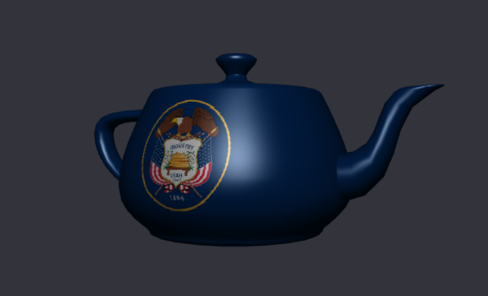

# CS 418 Projects


Hello! This is a collection of the machine projects I created in WebGL for my Computer Graphics class. 
* **MP 1**: Introduction to WebGL, animations, and button toggles
* **MP 2**: Terrain generation using the faulting method and shading
* **MP 3**: Camera movements and key events
* **MP 4**: Importing objects, Phong-Blinn shading, and texturing
* **MP 5**: Realtime physics

I haven't set up a proper website for all of these, but if you'd like to run the projects:
1. Clone the repository

```git clone https://github.com/BrendanParmer/CS418```

2. Navigate to the root directory of the repo

```cd [repo location]```

3. Create a server

```python3 -m http.server```

4. You can then open it up in your browser (Firefox or Chromium work) and navigate to any of the HTML files. Hope you enjoy!